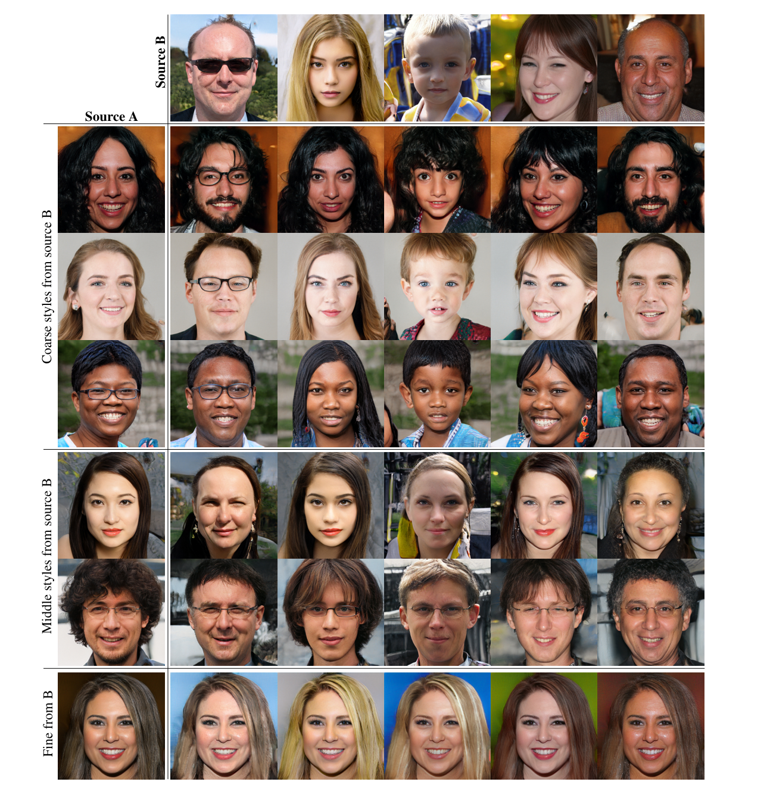

# DeepFake Detection Using GAN

## Description
This project aims to detect DeepFake videos using Generative Adversarial Networks (GANs). DeepFake videos have become a significant concern due to their potential misuse in spreading misinformation. This project provides a solution to identify such manipulated videos accurately.

To train our model effectively, we have used **StyleGAN** to generate fake images. StyleGAN enables us to create highly realistic synthetic faces, which are essential for improving our DeepFake detection model. The generated images help in balancing the dataset and enhancing the model's ability to distinguish between real and fake media.

## Table of Contents
- [Installation](#installation)
- [Usage](#usage)
- [Features](#features)
- [Dataset](#dataset)
- [Model](#model)
- [Results](#results)
  
## Installation
1. Clone the repository:
   ```sh
   git clone https://github.com/Tejas2620/DeepFake-Detection-Using-GAN.git
   cd DeepFake-Detection-Using-GAN
   ```
2. Create a virtual environment and activate it:
   ```sh
   python -m venv env
   ```
   - On Windows:
     ```sh
     .\env\Scripts\activate
     ```
   - On macOS/Linux:
     ```sh
     source env/bin/activate
     ```
3. Install the required dependencies:
   ```sh
   pip install -r requirements.txt
   ```

## Usage
1. Download the trained models from [Google Drive](https://drive.google.com/file/d/1ZYUyxwku9zzhe7cG_lOjmY2H97UmXsAS/view?usp=sharing).  
2. Place the models in the appropriate directory.  
3. Run the prediction script:
   ```sh
   python predict.py
   ```

## Features
- Detects DeepFake videos with high accuracy.
- Utilizes GANs for robust detection.
- Easy-to-use interface for predictions.

## Dataset
The dataset used for training and testing includes a diverse set of DeepFake and real videos. 
- [FFHQ Dataset](https://github.com/NVlabs/ffhq-dataset)
- [CelebA Dataset](https://www.kaggle.com/datasets/jessicali9530/celeba-dataset)

## Model
The model is based on GAN architecture, specifically designed for detecting manipulated videos. Detailed explanation of the model architecture and training process can be found [here](#).

## Results
The model achieves an accuracy of **87.58%** on the test dataset. Below are some sample results:



- Sample Result 1  
- Sample Result 2  

